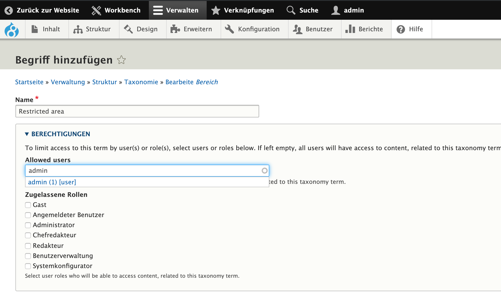
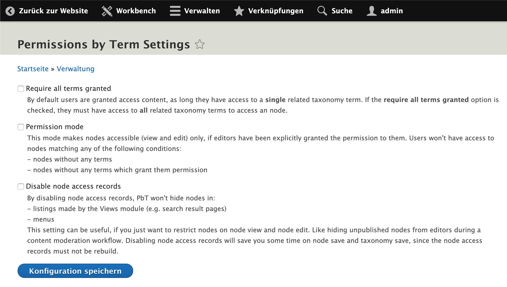

# Access restriction

deGov uses the taxonomy term vocabulary called "Bereich" (translated: section) for restricting access to content. Any content entities which
are tagged with the "Bereich" vocabulary, will be restricted in terms of
user or role permissions.

Not only the content entities will be restricted, but related files as
well.

The functionality is based on the following module:
- [Permissions by Term](https://www.drupal.org/project/permissions_by_term)
    - Submodule: Permissions by Entity
- [Permissions by Term Redirect](https://www.drupal.org/project/permissions_by_term_redirect)

The possible settings:

You might want to check [PbT's documentation](https://www.drupal.org/docs/8/modules/permissions-by-term).