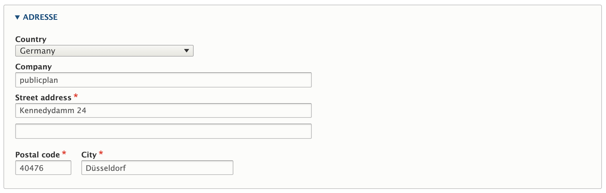
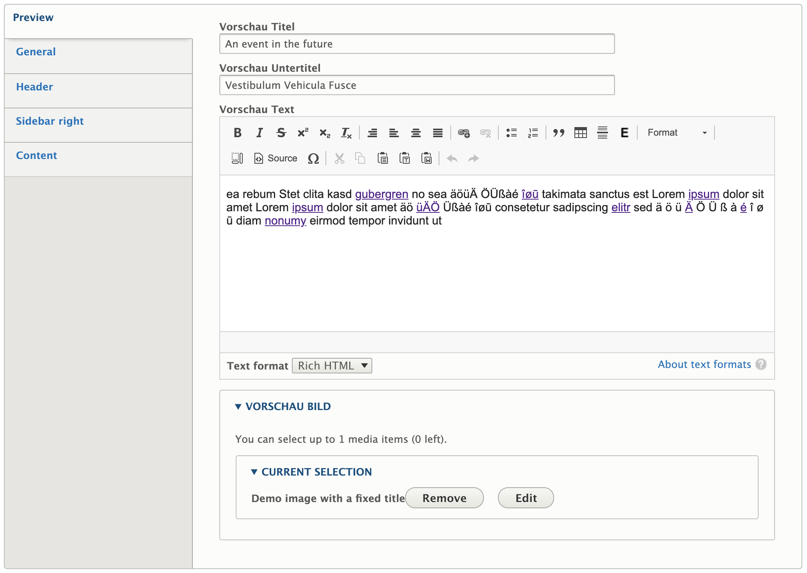
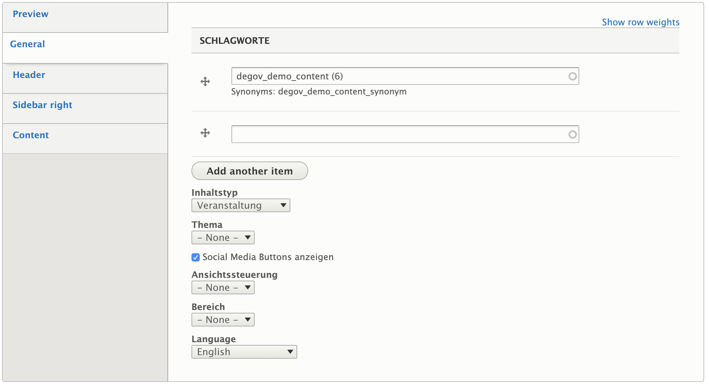
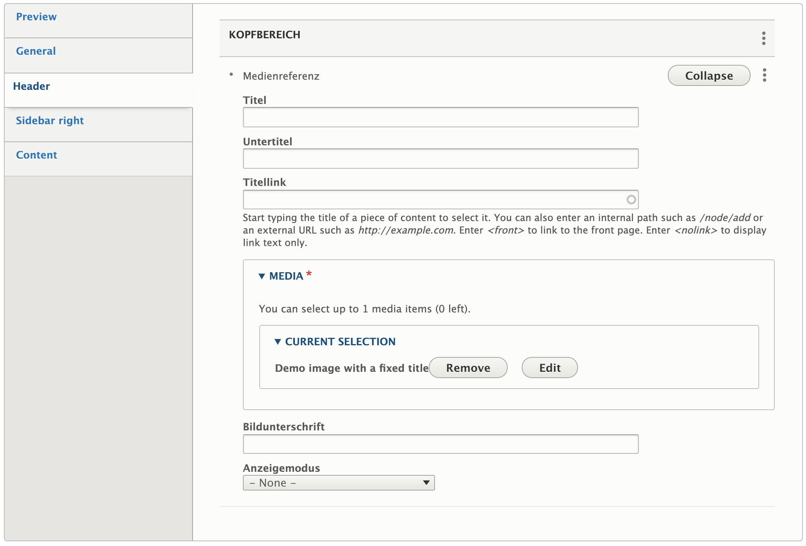
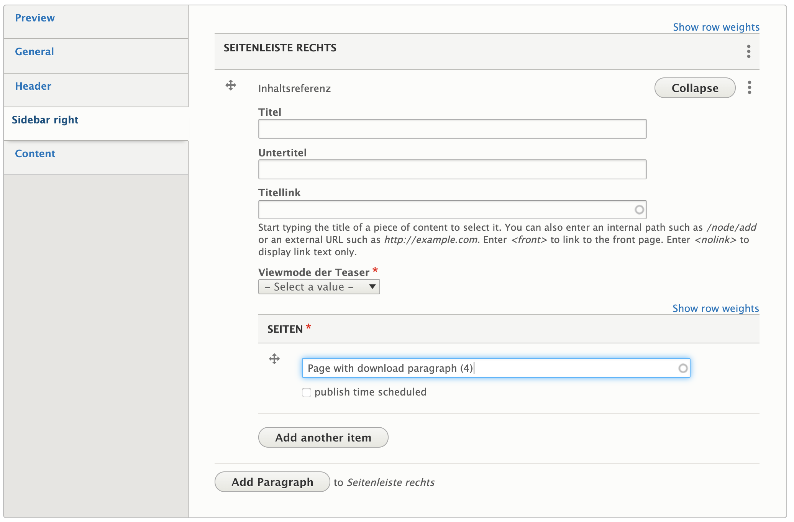
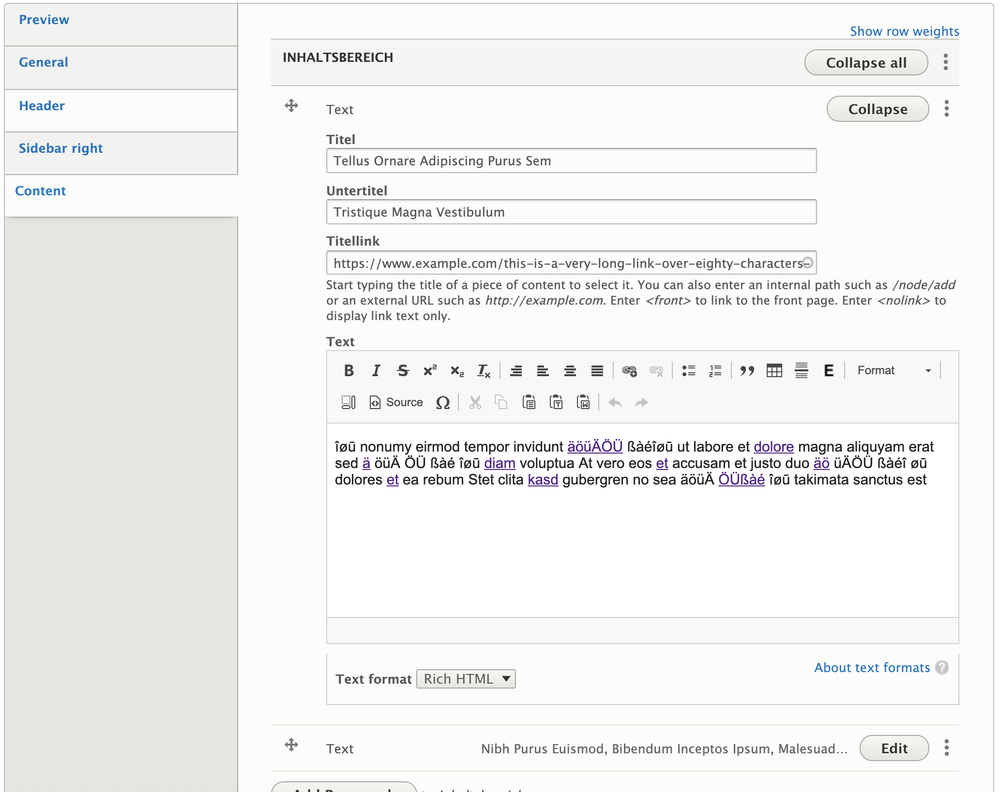
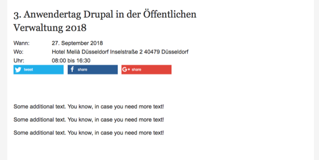

# Event

​
If a site features a list of events or a calendar, the *Event* content type comes preconfigured with a set of fields commonly required for this functionality.

An *Event* has a title and optional internal title. It also contains date and time fields to enter a start and end date. The display of the time part can optionally be turned on or off.

Additionally, an *Event* requires some information about the location at which it will be held.

In the tabbed sections, editors can add content to the event.

The **Preview** tab defines a separate teaser title and subtitle, a description, and image to be displayed if the Event is shown in a preview somewhere.

If we need to add keywords (with optional support for synonyms) to the *Event*, assign it a topic, or sort it into a thematic area, we can accomplish this in the **Common** section. That is also where the display of [Shariff](https://www.drupal.org/project/shariff) sharing buttons can be toggled.

The **Header** section can contain a paragraph that will be displayed at the top of the page. This could be, for example, a media reference.

In the **Sidebar right** section, we can add multiple paragraphs that will displayed in the sidebar of the *Event’s* page.

More details about the *Event* can be presented in the **Content** section by adding appropriate paragraphs.

The event will display its various contents in much the same way as general pages are displayed:

## Sidebar

In the sidebar of the node creation and edit form editors can find a number of collapsible fieldsets, providing additional functionality:

* Revision information: The last save time of the node, the username of the author, and a field to optionally describe the changes made between the last revision and the current version. Provided by [Drupal Core](https://www.drupal.org/docs/8/administering-a-drupal-8-site/node-revisions).
* Scheduled moderation: Allows scheduled changes to the moderation state of a node (e.g. publish or archive). Provided by the [Scheduled Publish module](https://www.drupal.org/project/scheduled_publish).
* Menu settings: Optionally create a menu link for the node and place it in one of the available menus. Provided by [Drupal Core](https://www.drupal.org/docs/user_guide/en/menu-link-from-content.html).
* Permissions by term: If the site uses Permissions by Term to control access to content based on taxonomies, the users and roles granted access to the current node will be listed here. Provided by the [Permissions by Term module](https://www.drupal.org/project/permissions_by_term).
* Simple XML sitemap: If the content type is enabled for inclusion in an XML sitemap, the general settings for the type can be overridden on a per-node basis here. Provided by the [Simple XML sitemap module](https://www.drupal.org/project/simple_sitemap).
* URL alias: Have Drupal automatically generate a URL alias for the node, or enter a custom alias. Provided by [Drupal Core](https://www.drupal.org/docs/user_guide/en/content-create.html).
* Authoring information: Pre-populated fields with info about the node's author and creation time. Provided by [Drupal Core](https://www.drupal.org/docs/user_guide/en/content-create.html).
* Promotion options: Options to mark the node as promoted to the front page or to make it sticky in lists. Provided by [Drupal Core](https://www.drupal.org/docs/user_guide/en/content-create.html).

## Patches welcome!

deGov was originally developed with a focus primarily on the German market. As you can tell from the mixed languages in the screenshots, a lot of our config​ still reflects this older approach.

We are constantly improving upon this situation ourselves, but we are also happy to receive [contributed patches](https://www.drupal.org/project/issues/degov)!