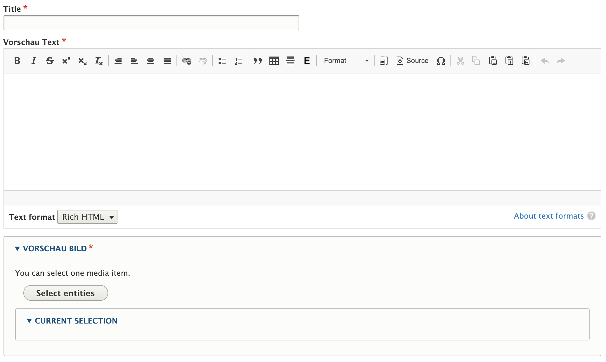
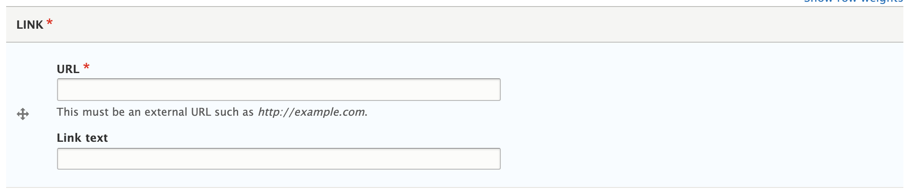
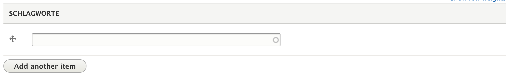
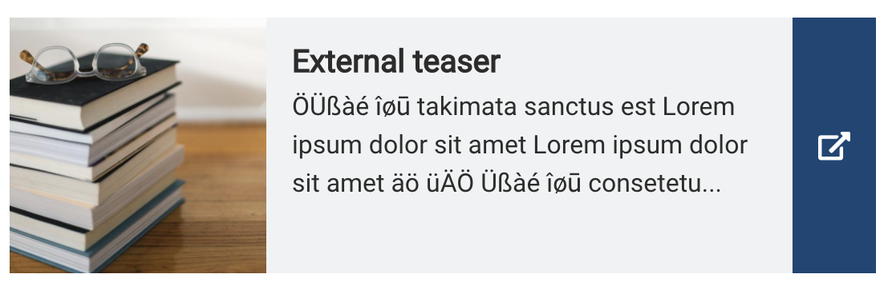

# External Teaser

With this content type we can create references to content external to our own website, and display them as teasers in our pages.

The *External teaser* type consists of a title field, a teaser text and image, a link field, as well as giving the option to add some keywords.

The link entered in the **Link** field must be an absolute URL, such as [http://example.com/some-page](http://example.com/some-page)

When included in another node as a content reference, the *External teaser* will appear as any regular teaser, but the entire element will link to the link saved in the link field:

## Sidebar

In the sidebar of the node creation and edit form editors can find a number of collapsible fieldsets, providing additional functionality:

* Revision information: The last save time of the node, the username of the author, and a field to optionally describe the changes made between the last revision and the current version. Provided by [Drupal Core](https://www.drupal.org/docs/8/administering-a-drupal-8-site/node-revisions).
* Permissions by term: If the site uses Permissions by Term to control access to content based on taxonomies, the users and roles granted access to the current node will be listed here. Provided by the [Permissions by Term module](https://www.drupal.org/project/permissions_by_term).
* Simple XML sitemap: If the content type is enabled for inclusion in an XML sitemap, the general settings for the type can be overridden on a per-node basis here. Provided by the [Simple XML sitemap module](https://www.drupal.org/project/simple_sitemap).
* URL alias: Have Drupal automatically generate a URL alias for the node, or enter a custom alias. Provided by [Drupal Core](https://www.drupal.org/docs/user_guide/en/content-create.html).
* Authoring information: Pre-populated fields with info about the node's author and creation time. Provided by [Drupal Core](https://www.drupal.org/docs/user_guide/en/content-create.html).
* Promotion options: Options to mark the node as promoted to the front page or to make it sticky in lists. Provided by [Drupal Core](https://www.drupal.org/docs/user_guide/en/content-create.html).

## Patches welcome!

deGov was originally developed with a focus primarily on the German market. As you can tell from the mixed languages in the screenshots, a lot of our config​ still reflects this older approach.

We are constantly improving upon this situation ourselves, but we are also happy to receive [contributed patches](https://www.drupal.org/project/issues/degov)!