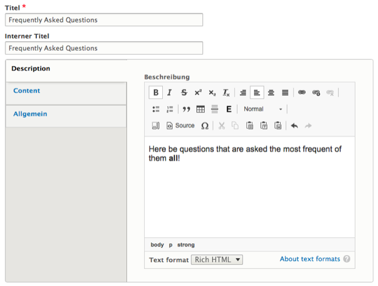
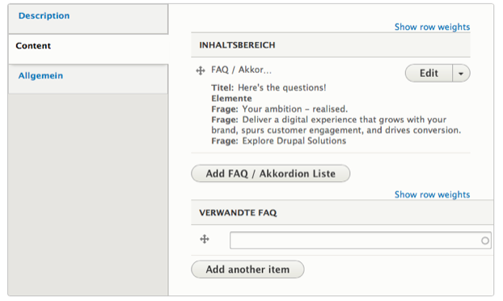
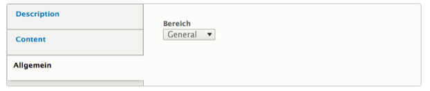
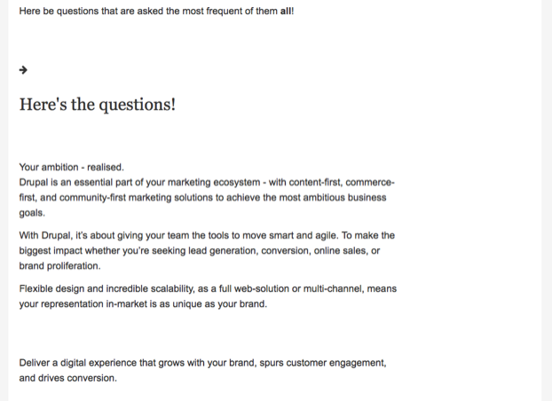

# FAQ

The *FAQ* content type can contain an arbitrary number of paragraphs, each with a plain text question and a rich text answer.

Aside from the usual title fields, an *FAQ* can have a **Description** text, entered in the tab of the same name.

The **Content** tab can contain one or more “FAQ” paragraphs. Each paragraph in turn can hold multiple paragraphs with a single question and answer pair.
In addition, thematically related *FAQ* nodes can be referenced here.

In the **Common** tab, the FAQ can be assigned a topic area.

In the finished *FAQ* node the questions will be displayed as an accordion element. The headlines are clickable, revealing their corresponding answers on user interaction.

## Sidebar

In the sidebar of the node creation and edit form editors can find a number of collapsible fieldsets, providing additional functionality:

* Revision information: The last save time of the node, the username of the author, and a field to optionally describe the changes made between the last revision and the current version. Provided by [Drupal Core](https://www.drupal.org/docs/8/administering-a-drupal-8-site/node-revisions).
* Scheduled moderation: Allows scheduled changes to the moderation state of a node (e.g. publish or archive). Provided by the [Scheduled Publish module](https://www.drupal.org/project/scheduled_publish).
* Meta tags: Allows the entry of various meta information, from basics like title and description to specifics like settings for Twitter Cards. Provided by the [Metatag module](https://www.drupal.org/project/metatag).
* Permissions by term: If the site uses Permissions by Term to control access to content based on taxonomies, the users and roles granted access to the current node will be listed here. Provided by the [Permissions by Term module](https://www.drupal.org/project/permissions_by_term).
* Simple XML sitemap: If the content type is enabled for inclusion in an XML sitemap, the general settings for the type can be overridden on a per-node basis here. Provided by the [Simple XML sitemap module](https://www.drupal.org/project/simple_sitemap).
* URL alias: Have Drupal automatically generate a URL alias for the node, or enter a custom alias. Provided by [Drupal Core](https://www.drupal.org/docs/user_guide/en/content-create.html).
* Authoring information: Pre-populated fields with info about the node's author and creation time. Provided by [Drupal Core](https://www.drupal.org/docs/user_guide/en/content-create.html).
* Promotion options: Options to mark the node as promoted to the front page or to make it sticky in lists. Provided by [Drupal Core](https://www.drupal.org/docs/user_guide/en/content-create.html).

## Patches welcome!

deGov was originally developed with a focus primarily on the German market. As you can tell from the mixed languages in the screenshots, a lot of our config​ still reflects this older approach.

We are constantly improving upon this situation ourselves, but we are also happy to receive [contributed patches](https://www.drupal.org/project/issues/degov)!