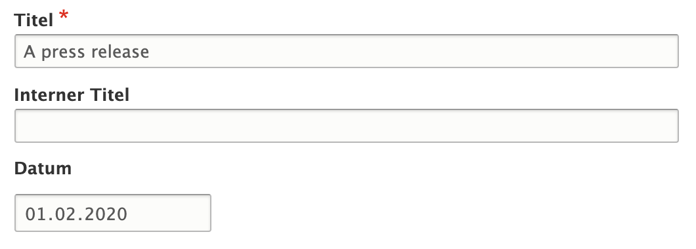
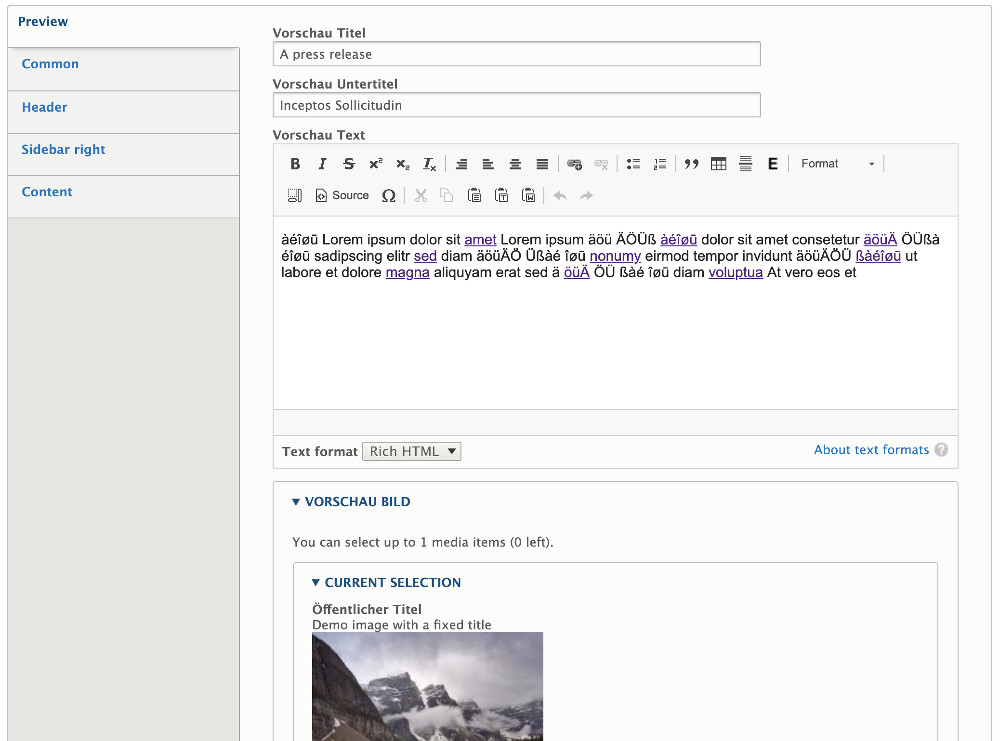
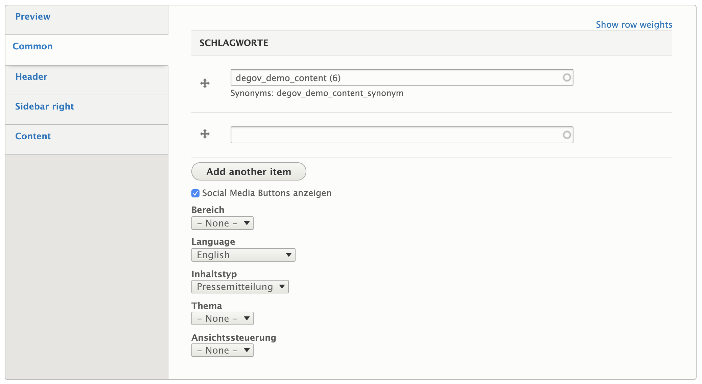
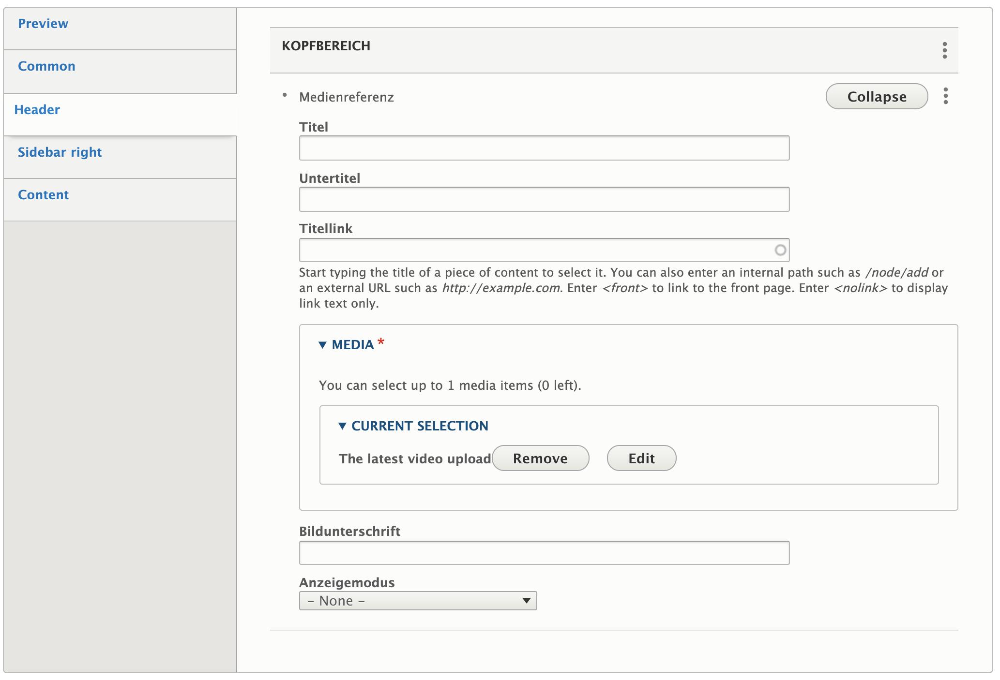
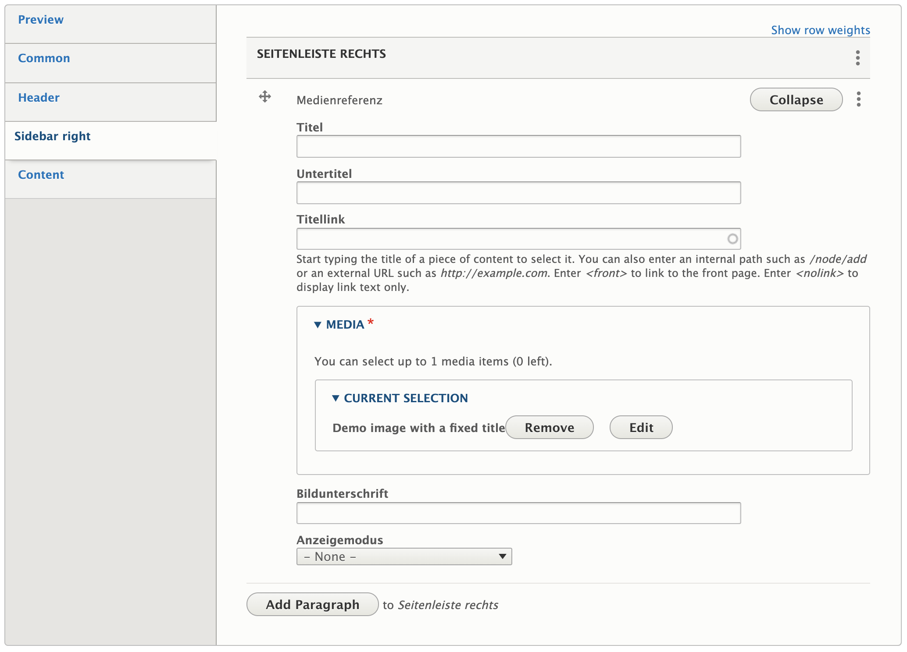
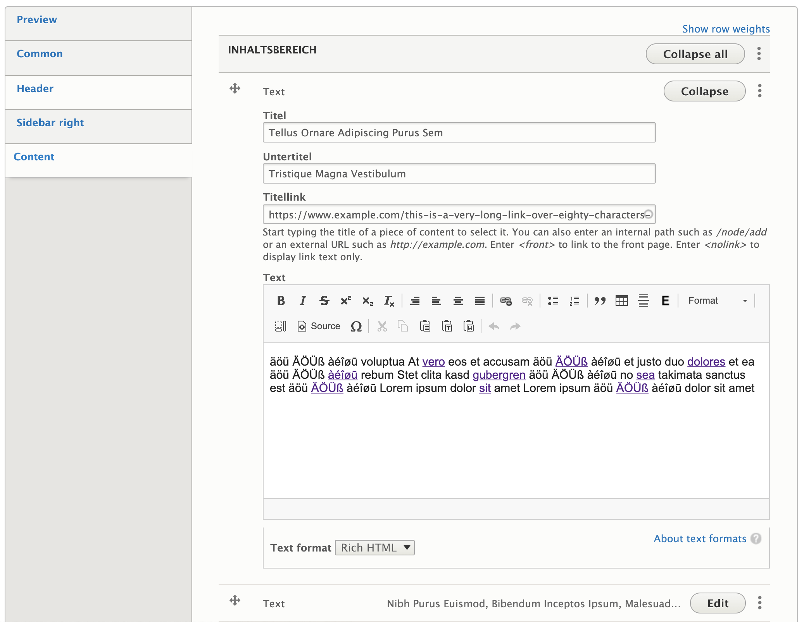

# Press Release

*Press release* nodes are structured very much like the *Normal page* type, but with an added publication date field.

The *Press release* content type is segmented into the following tabs:

* Preview
* Common
* Header
* Sidebar right
* Content

A *Press release* has title and internal title fields, as well as a publication date.

The **Preview** tab enables editors to define a teaser title and subtitle, a teaser text, and a preview image to be displayed in teaser views, such as the “Press releases” block.

The **Common** tab contains fields to enrich *Press releases* by adding keywords (with optional support for synonyms), or by sorting them into a topic or thematic section.
In addition, editors can decide whether sharing buttons provided by the [Shariff](https://www.drupal.org/project/shariff) module should be added to the node.

In the **Header** tab we can add one paragraph, for example a media reference. It will be displayed at the top of the *Press release* page.

Similarly the **Sidebar right** can be assembled from a list of paragraphs, combined in whatever way is required.

The **Content** tab contains a paragraphs field. In said field we can assemble the main content of the *Press release* from a variety of paragraphs, such as text content, media references etc.

## Sidebar

In the sidebar of the node creation and edit form editors can find a number of collapsible fieldsets, providing additional functionality:

* Revision information: The last save time of the node, the username of the author, and a field to optionally describe the changes made between the last revision and the current version. Provided by [Drupal Core](https://www.drupal.org/docs/8/administering-a-drupal-8-site/node-revisions).
* Scheduled moderation: Allows scheduled changes to the moderation state of a node (e.g. publish or archive). Provided by the [Scheduled Publish module](https://www.drupal.org/project/scheduled_publish).
* Menu settings: Optionally create a menu link for the node and place it in one of the available menus. Provided by [Drupal Core](https://www.drupal.org/docs/user_guide/en/menu-link-from-content.html).
* Meta tags: Allows the entry of various meta information, from basics like title and description to specifics like settings for Twitter Cards. Provided by the [Metatag module](https://www.drupal.org/project/metatag).
* Permissions by term: If the site uses Permissions by Term to control access to content based on taxonomies, the users and roles granted access to the current node will be listed here. Provided by the [Permissions by Term module](https://www.drupal.org/project/permissions_by_term).
* Simple XML sitemap: If the content type is enabled for inclusion in an XML sitemap, the general settings for the type can be overridden on a per-node basis here. Provided by the [Simple XML sitemap module](https://www.drupal.org/project/simple_sitemap).
* URL alias: Have Drupal automatically generate a URL alias for the node, or enter a custom alias. Provided by [Drupal Core](https://www.drupal.org/docs/user_guide/en/content-create.html).
* Authoring information: Pre-populated fields with info about the node's author and creation time. Provided by [Drupal Core](https://www.drupal.org/docs/user_guide/en/content-create.html).
* Promotion options: Options to mark the node as promoted to the front page or to make it sticky in lists. Provided by [Drupal Core](https://www.drupal.org/docs/user_guide/en/content-create.html).

## Patches welcome!

deGov was originally developed with a focus primarily on the German market. As you can tell from the mixed languages in the screenshots, a lot of our config​ still reflects this older approach.

We are constantly improving upon this situation ourselves, but we are also happy to receive [contributed patches](https://www.drupal.org/project/issues/degov)!

