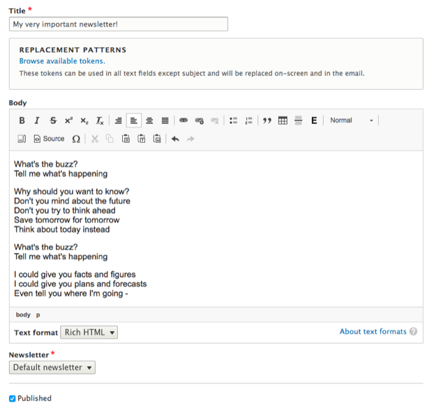

# Newsletter Issue

Using the [Simplenews](https://www.drupal.org/project/simplenews) module, deGov comes out of the box with an easy-to-use basic newsletter system.

Editors can use the *Newsletter Issue* content type to create and send an email to a Simplenews mailing list.

The *Newsletter Issue* content type has fields for a title and a rich text body. The rich text field supports Drupal’s token system to add dynamic text data.

In the **Newsletter** dropdown we can select which mailing list the node should be distributed to.

When the *Newsletter Issue* has been saved, a new tab **Newsletter** will become available. Here we can send the issue to a specific email address as a test, or queue it for distribution to the subscribed addresses.

For more details about newsletter configuration, see the [Simplenews documentation](https://www.drupal.org/node/197057).

## Sidebar

In the sidebar of the node creation and edit form editors can find a number of collapsible fieldsets, providing additional functionality:

* Revision information: The last save time of the node, the username of the author, and a field to optionally describe the changes made between the last revision and the current version. Provided by [Drupal Core](https://www.drupal.org/docs/8/administering-a-drupal-8-site/node-revisions).
* Scheduled moderation: Allows scheduled changes to the moderation state of a node (e.g. publish or archive). Provided by the [Scheduled Publish module](https://www.drupal.org/project/scheduled_publish).
* Menu settings: Optionally create a menu link for the node and place it in one of the available menus. Provided by [Drupal Core](https://www.drupal.org/docs/user_guide/en/menu-link-from-content.html).
* Permissions by term: If the site uses Permissions by Term to control access to content based on taxonomies, the users and roles granted access to the current node will be listed here. Provided by the [Permissions by Term module](https://www.drupal.org/project/permissions_by_term).
* Simple XML sitemap: If the content type is enabled for inclusion in an XML sitemap, the general settings for the type can be overridden on a per-node basis here. Provided by the [Simple XML sitemap module](https://www.drupal.org/project/simple_sitemap).
* URL alias: Have Drupal automatically generate a URL alias for the node, or enter a custom alias. Provided by [Drupal Core](https://www.drupal.org/docs/user_guide/en/content-create.html).
* Authoring information: Pre-populated fields with info about the node's author and creation time. Provided by [Drupal Core](https://www.drupal.org/docs/user_guide/en/content-create.html).
* Promotion options: Options to mark the node as promoted to the front page or to make it sticky in lists. Provided by [Drupal Core](https://www.drupal.org/docs/user_guide/en/content-create.html).

## Patches welcome!

deGov was originally developed with a focus primarily on the German market. As you can tell from the mixed languages in the screenshots, a lot of our config​ still reflects this older approach.

We are constantly improving upon this situation ourselves, but we are also happy to receive [contributed patches](https://www.drupal.org/project/issues/degov)!