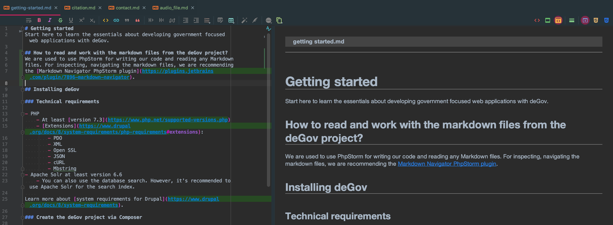

# Getting started

## Table of contents
- [How to read and work with the Markdown files from the deGov project?](#how-to-read-and-work-with-the-markdown-files-from-the-degov-project)
- [Installing deGov](#installing-degov)
    - [Technical requirements](#technical-requirements)
    - [Create the deGov project via Composer](#create-the-degov-project-via-composer)
        - [With packages for development purpose](#with-packages-for-development-purpose)
        - [Without packages for production purpose](#without-packages-for-production-purpose)
    - [Run the deGov installer](#run-the-degov-installer)
Start here to learn the essentials about developing government focused web applications with deGov.

## How to read and work with the Markdown files from the deGov project?
We are used to use PhpStorm for writing our code and reading any Markdown
files. For inspecting, navigating the markdown files, we recommend
the [Markdown Navigator PhpStorm plugin](https://plugins.jetbrains.com/plugin/7896-markdown-navigator).



## Installing deGov

### Technical requirements

- PHP
    - At least [version 7.3](https://www.php.net/supported-versions.php)
    - [Extensions](https://www.drupal.org/docs/8/system-requirements/php-requirements#extensions):
        - PDO
        - XML
        - Open SSL
        - JSON
        - cURL
        - Mbstring
- Apache Solr at least version 6.6
    - The database search is installed by default. If you want to use advanced search functions, then install Apache Solr in at least version 6.6.
    
Learn more about [system requirements for Drupal](https://www.drupal.org/docs/8/system-requirements).

### Create the deGov project via Composer

#### With packages for development purpose
```
composer create-project degov/degov-project my_project_name/ --prefer-source --keep-vcs
```
Make sure your webserver is pointing the deGov host to the docroot directory. After Composer has fetched all code sources for you, you can install deGov into your database.

#### Without packages for production purpose
```
composer create-project degov/degov-project folder_name/ --prefer-dist --remove-vcs --no-dev
```

More about [composers create-project command](https://getcomposer.org/doc/03-cli.md#create-project).

### Run the deGov installer
After you have setup the project structure via Composer in your filesystem, you can install deGov like a traditional Drupal via the web installer or Drush. However, we do recommend the installation via our [Robo build tool](https://robo.li/) commands. It's quicker and handier. Just run the following command from the project root folder:
```
./bin/robo degov:site-install
```

To see all available Robo commands run:
```
./bin/robo list
```
