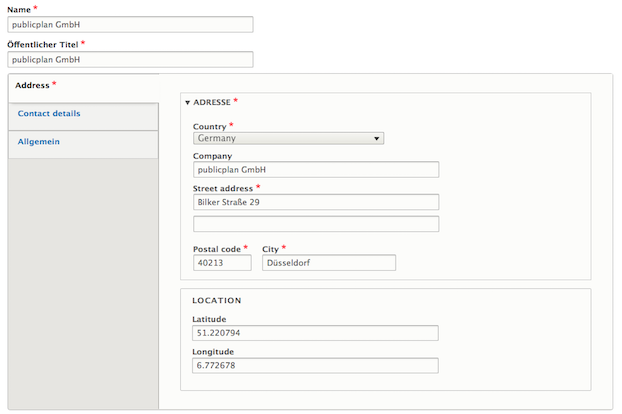
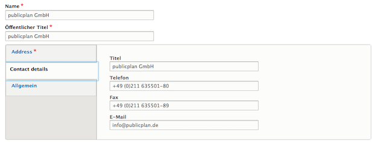
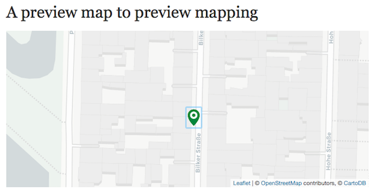

# Address
The Address type enables editors to store information related to a location, such as geocoordinates or general address and contact information.

If the fields for latitude and longitude are filled out, the address can be used to place a marker in a map paragraph.

The full set of data will show up in search results or if the Address is referenced using the Media Reference paragraph.

The Address media type depends on the [Geofield](https://www.drupal.org/project/geofield) module.