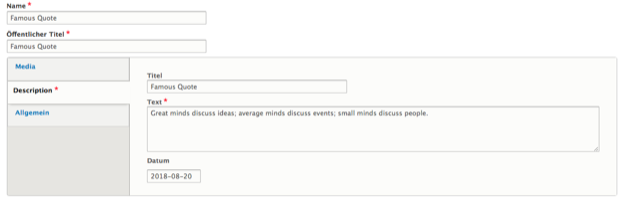
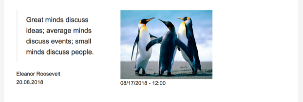

# Citation

With the Citation media type editors can add quotations to their site.

The core of a Citation is the main text itself, coupled with a source and a date.

Optionally editors can attach a media entity to the citation.

These contents will be output as a `<blockquote>` element for the main quote body, surrounded by the additional information.

