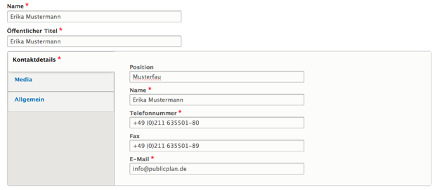

# Contact
_Contacts_ represent individual persons with explicit fields for communications-relevant information, such as phone numbers or email addresses.

Additionally contacts can have a media item such as an image attached to them. When the contact is embedded, for example from within a Media reference paragraph, the image will be displayed next to the textual contact information.