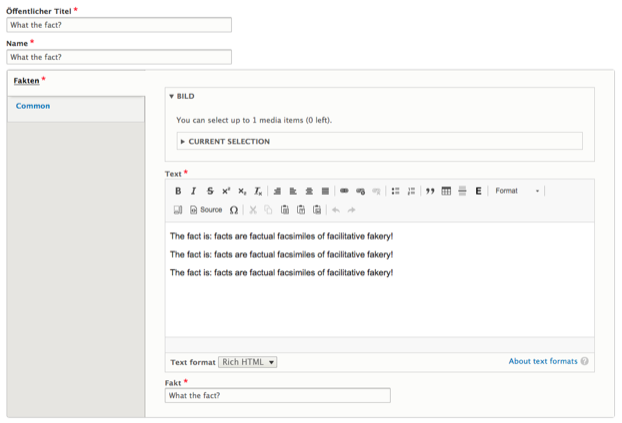

# Fact
To present factual information, editors can use the _Facts_ media type. It consists of a rich text field to describe the context surrounding the fact, as well as a text field to contain the actual fact.

Optionally a media item such as an image can be attached to the fact. When the fact is embedded on a page, the optional media will be displayed next to it.