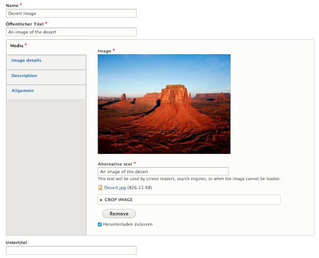
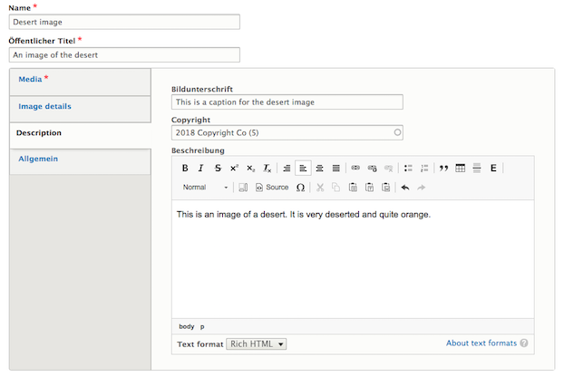

# Image
The _Image_ type represents a single image in each node. It can be cropped, as well as enriched with additional information such as a caption, copyright information or a more detailed description.

Once created images can be displayed as content in Media Reference paragraphs, Slideshow slides, page headers etc.