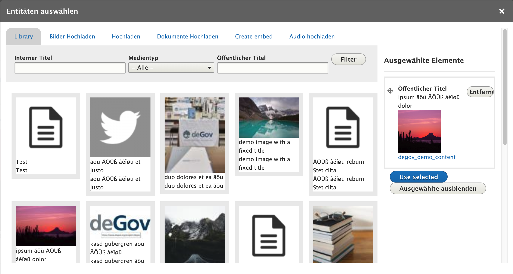
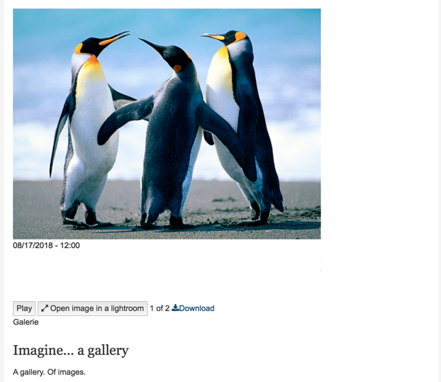

# Image gallery
Multiple images can be presented in an Image gallery media entity.

To build an image gallery an editor can select multiple media items and add them to the gallery.

Additional text information can be added to add context to the visual content.

An embedded gallery will be output as a slideshow of the included media entities. The slideshow can be set to auto-progress using the Play / Pause button. Using the Open image in a lightroom button the image will be displayed in a lightbox modal display.

