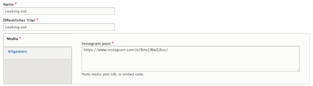

# Instagram
In order to embed content from Instagram, editors can create _Instagram_ media entities.

An editor need only provide the URL of an Instagram post. When the media entity is referenced and displayed, the Instagram post will be embedded in the page.

The Instagram media type extends upon the [Media entity Instagram](https://www.drupal.org/project/media_entity_instagram) module.