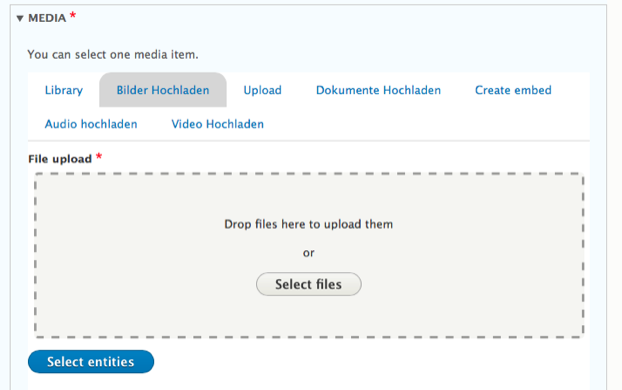

# Media types
deGov offers site editors an extensive list of types of media they can create and re-use in various contexts across their project. These range from basic types like images and simple documents to more complex structures such as video uploads and image galleries.

## Browsing media
Editors can manage their media both from the Media tab of Drupal’s Content section, as well as from within a node form.

New media content can be created directly from within a node using deGov’s Media Entity browser. It provides type-appropriate inputs to upload new media using Dropzone.js or to, for example, paste a social media embed code.

Most media types are defined in distinct modules that can be enabled depending on the project’s needs. Where appropriate the modules will extend the _Media Entity_ browser with tabs allowing for the creation of new media content.

## Modules and libraries
deGov's media system builds upon the following modules and libraries to provide its media management functionality:
- Media (Drupal core)
- [Dropzone.js](https://www.dropzonejs.com/)

Community modules more closely related to specific media types are mentioned in the corresponding section below.