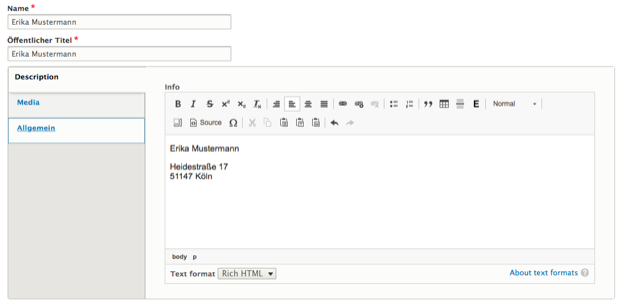

# Person
To generate more generic representations of persons who are not necessarily contacts, editors can use the Person media type. Here they can provide personal details in a rich text field and attach a piece of media.

The resulting _Person_ media entities can be referenced from within media embed paragraphs.

