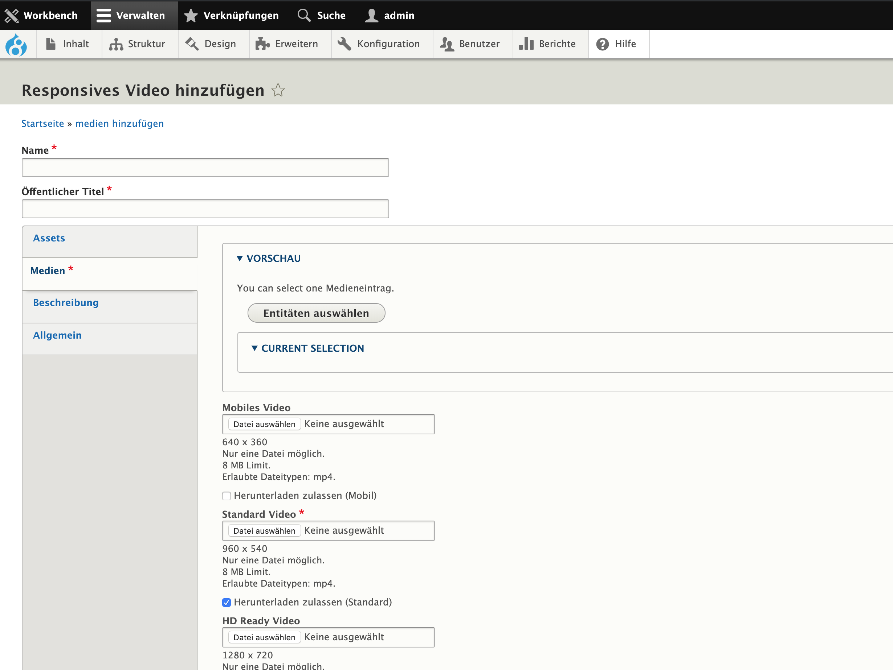

# Responsive video

The responsive video media type allows you to upload video files in
multiple formats:
- Mobile video
- Standard video
- HD ready video
- Full HD video
- Ultra HD 4K video

By using the functionality from the `degov_media_video_mobile` module,
the current internet speed and device will be checked. As a result, the
proper video file will be delivered. Note: for providing the appropriate
format, the necessary video file must be uploaded to the responsive video
media entity. Currently there's the standard video required only. By
viewing the responsive video media entity, you are still able to select
the video quality manually.