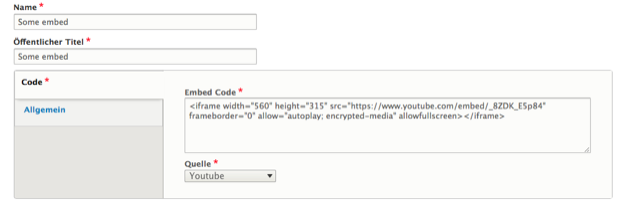

# Social Media Embed
The most generic way to embed social media content on a page. The editor only needs to provide the embed code for the post, as well as select the service the content will be embedded from. The latter is to ensure that visitors will only see content from services they have enabled in their social media settings.

