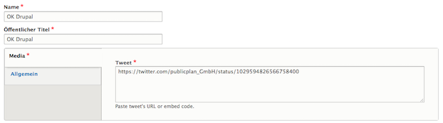

# Tweet
Similar to the Instagram media type, the Tweet media type enables editors to enter the URL to a Twitter post. When the Tweet entity is referenced, the linked tweet will be embedded in the page.

