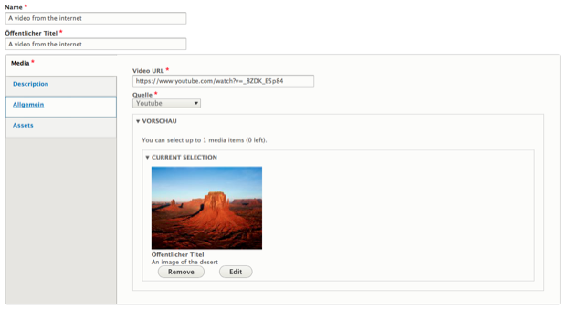

# Video
To embed a video from an external service such as YouTube or Vimeo, editors can use the _Video_ media type.

All that is required is the URL of the video on the third party service, the selection of a preview image, and the selection of the service the video is hosted on. The preview image will be displayed for example in search results. The selection of the service is necessary to ensure that visitors will only see content from services they have enabled in their social media settings.

The _Video_ type builds upon the [Video Embed Field](https://www.drupal.org/project/video_embed_field) module.