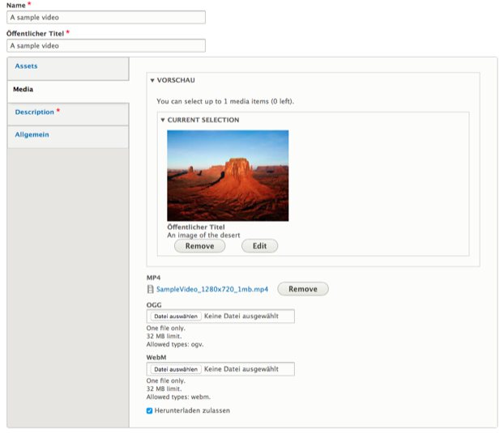
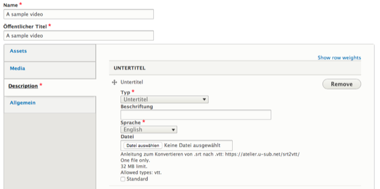
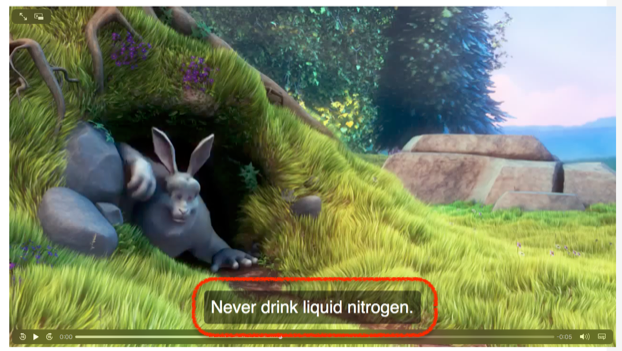
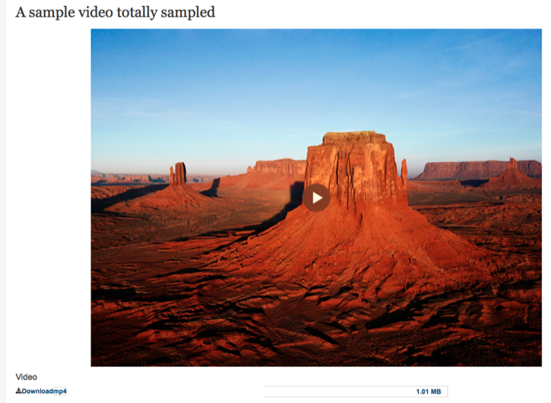

# Video upload
For videos that are not hosted on a third party platform and should instead be self-hosted, editors can use the Video upload media type.

Editors can upload videos in MP4, OGG, and WebM video formats. The uploaded files will be offered as alternate `<source>` elements to the video, allowing the browser to pick the preferred format.

Additionally editors have the ability to upload [WebVTT files](https://developer.mozilla.org/en-US/docs/Web/API/WebVTT_API) to provide their users with subtitles and other information attached to the video.

The uploaded video will then be displayed as a HTML5 `<video>` element in the page, with the selected preview image used as the placeholder for the video.

